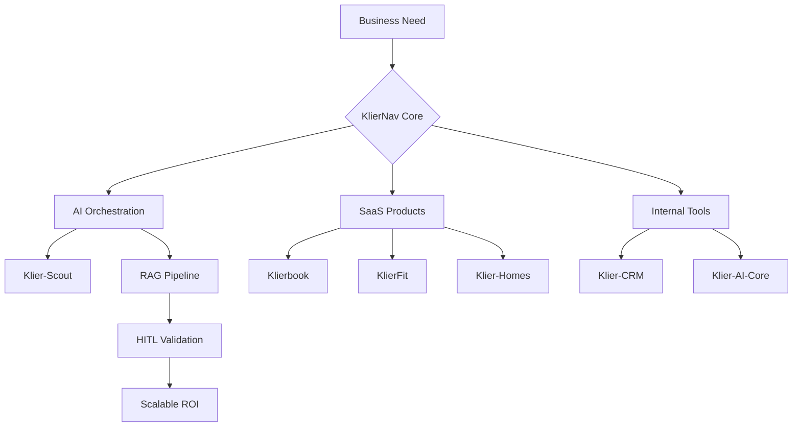
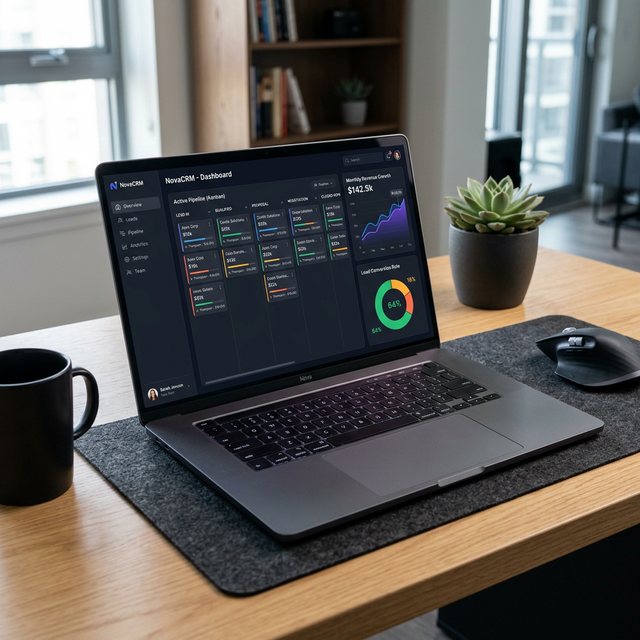
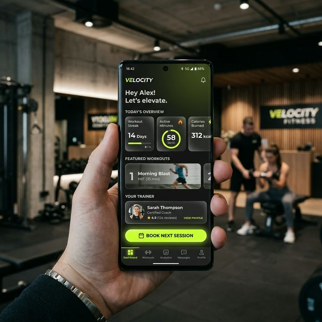

# 🚀 Serj Callier | Founder @ [KlierNav Innovations](https://www.kliernav.com)

### 💡 Vision & Impact
I am the founder of **KlierNav Innovations**, an AI-First digital agency based in Argentina. We don't just build software; we engineer **intelligent ecosystems** that scale businesses through high-precision automation and human-centric design.

### 🧠 My Philosophy: AI-First + HITL
Automation drives scale, but human supervision ensures excellence. My approach centers on building systems that handle the "heavy lifting" while keeping a **Human-In-The-Loop (HITL)** to guarantee precision, empathy, and strategic quality.

### 🔭 Currently Innovating
- **KlierNav Employee Portal:** Engineering a hyper-realistic React/TypeScript portal with AI-driven dashboards and internal orchestration.
- **Agentic Workflows:** Deep-diving into recursive AI agents for lead discovery and data enrichment.

> *"Designing AI operating systems where automation drives scale, and Human-In-The-Loop (HITL) ensures excellence."*

---

### 🛠️ The Tech Ecosystem
| Layer | Technologies |
| :--- | :--- |
| **Frontend & UI/UX** |     |
| **Backend & Data** |     |
| **AI & Automation** |       |
| **Infrastructure** |    |

---

### 🌟 Active Innovation (Featured Projects)

#### 📅 [Klierbook](https://github.com/SerjCallier/klierbook)
**Premium Booking SaaS** integrated with n8n and Google Sheets. Designed for high-end professional services.
- **Impact:** Zero-subscription entry for businesses with enterprise-grade scaling potential.
- **Tech:** React 19, Tailwind, n8n Orchestration.

#### 🤖 [Klier-AI-Core](https://github.com/SerjCallier/klier-ai-core)
Technical deep-dive into **RAG pipelines**, Lead Scoring engines, and B2B automation flows.
- **Core Value:** Demonstrating the "AI-First" middleware approach for front-office operations.
- **Tech:** Gemini Pro, n8n, Custom Node Orchestrators.

#### 📊 [Klier-CRM](https://github.com/SerjCallier/klier-crm)
Internal ops tool featuring interactive Kanban boards and MRR analytics.
- **Tech:** Hello-Pangea DND, Recharts, Supabase Auth.

#### 🏠 [Klier-Homes](https://github.com/SerjCallier/klier-homes)
High-performance property catalog with immersive galleries and SEO optimization.
- **Tech:** Mobile-First React, AI RAG Agent for inquiries.

#### 🏋️ [KlierFit](https://github.com/SerjCallier/klierfit)
Premium landing page for gyms with energetic aesthetics and lead conversion focus.
- **Tech:** React 19, Tailwind, Framer Motion.

#### 🗺️ [Klier-Scout](https://github.com/SerjCallier/klier-scout)
Automated data engine for business discovery and digital health auditing.
- **Tech:** Node.js, Puppeteer, AI Scoring Pipeline.

---

### 📈 GitHub Insights
&nbsp; 
&nbsp; 

&nbsp; 
&nbsp; 

### 📬 Let's Connect
- 💼 [LinkedIn](https://www.linkedin.com/in/sergio-callier-578b71a3)
- 🌐 [Official Website](https://www.kliernav.com)
- 📧 [Email Me](mailto:callier.sergio@gmail.com)

---

🇦🇷 Versión en Español

## 🚀 Serj Callier | Fundador @ KlierNav Innovations

Soy el fundador de **KlierNav Innovations**, una agencia digital *AI-First* basada en Argentina. No solo construimos software; diseñamos **ecosistemas inteligentes** que escalan negocios a través de automatización de alta precisión y diseño centrado en lo humano.

### 🧠 Filosofía: AI-First + HITL
La automatización impulsa la escala, pero la supervisión humana garantiza la excelencia. Mi enfoque se centra en sistemas que hacen el trabajo pesado, con un **Human-In-The-Loop (HITL)** que garantiza precisión, empatía y calidad estratégica.

### 🔭 Actualmente Trabajando En
- **Portal del Empleado KlierNav:** Portal React/TypeScript con dashboards impulsados por IA.
- **Flujos Agénticos:** Agentes recursivos de IA para descubrimiento de leads y enriquecimiento de datos.

### 🛠️ Stack Tecnológico
| Capa | Tecnologías |
| :--- | :--- |
| **Frontend** | React 19 · TypeScript · Tailwind CSS · Vite |
| **Backend & Datos** | Python · Node.js · Supabase · PostgreSQL |
| **IA & Automatización** | n8n · Gemini Pro · Claude 3 · LangChain · OpenAI · Perplexity |
| **Infraestructura** | Docker · GitHub Actions · Cloudflare |

### 📬 Contacto
- 💼 [LinkedIn](https://www.linkedin.com/in/sergio-callier-578b71a3)
- 🌐 [Sitio Web](https://www.kliernav.com)
- 📧 [Email](mailto:callier.sergio@gmail.com)

